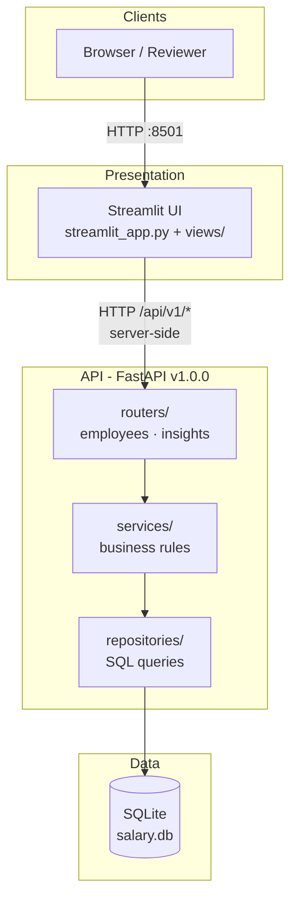

# Salary Management System v1.0.0

A full-stack HR salary management application for ~10,000 employees: **FastAPI** REST API (versioned), **SQLite** persistence, **Streamlit** dashboard, and **Docker** deployment.

**Repository:** [github.com/Kishan-Srivastava/salary_management](https://github.com/Kishan-Srivastava/salary_management)

| | |
|---|---|
| **App version** | 1.0.0 |
| **API version** | v1 (`/api/v1`) |
| **Stack** | Python 3.12 · FastAPI · SQLAlchemy · Streamlit · pytest |

---

## Live demo (for interviewers)

| Application | URL |
|-------------|-----|
| **Dashboard (Streamlit)** | [http://3.111.144.98:8501](http://3.111.144.98:8501) |
| **API docs (Swagger)** | [http://3.111.144.98:8001/docs](http://3.111.144.98:8001/docs) |
| **API health** | [http://3.111.144.98:8001/api/v1/health](http://3.111.144.98:8001/api/v1/health) |

> Hosted on **AWS EC2** (Docker). First visit after idle time may take ~30s while the instance responds. Demo data: **500 employees** seeded on first API start.

Alternative hosting (Render): see [DEPLOY.md](DEPLOY.md) — [](https://render.com/deploy?repo=https://github.com/Kishan-Srivastava/salary_management)

---

## Architecture



### Layered backend (clean architecture)

| Layer | Responsibility | Location |
|-------|----------------|----------|
| **Routers** | HTTP, query params, status codes | `app/routers/` |
| **Services** | Business rules, orchestration | `app/services/` |
| **Repositories** | SQLAlchemy queries, filters | `app/repositories/` |
| **Models** | ORM entities | `app/models/` |
| **Schemas** | Pydantic request/response DTOs | `app/schemas/` |

The UI is a **thin client**: Streamlit calls the REST API over HTTP (no direct DB access). Versioned routes are mounted in `app/api/v1/router.py`.

### Key identifiers

| ID | Type | Purpose |
|----|------|---------|
| `id` | UUID | Internal primary key (auto-generated) |
| `emp_id` | Integer, unique | Human-friendly ID for search and UI |

---

## Architectural decisions

| Decision | Choice | Rationale |
|----------|--------|-----------|
| **API versioning** | Path prefix `/api/v1` | Breaking changes can ship as v2 without breaking clients; health exposes `app_version` + `api_version`. |
| **Liveness vs versioned health** | `GET /health` (minimal) + `GET /api/v1/health` (full) | Load balancers/Docker need a tiny probe; clients get version metadata on the versioned route. |
| **Layered API** | Routers → services → repositories | Testable units, clear separation of HTTP vs SQL vs rules; matches TDD step-by-step build. |
| **SQLite** | File DB (`salary.db`) | Zero extra infrastructure for assessment/demo; sufficient for ~10k rows with indexes. |
| **Emp ID** | Auto-increment integer separate from UUID | Easier HR search and UI labels than raw UUID; UUID kept for stable internal references. |
| **List filters in SQL** | Repository-level `LIKE` / partial match | Scales better than loading all rows; name vs job-title use different match rules (see tradeoffs). |
| **Insights via SQL aggregation** | `GROUP BY` in repository | Accurate stats at scale; not computed in Python over full table. |
| **Streamlit + `st.navigation`** | Multi-page sidebar app | Fast iteration for dashboards; separate pages per feature area. |
| **UI/API split in Docker** | Two containers, internal `http://api:8000` | Mirrors production pattern; public URL shown via `PUBLIC_API_URL` on AWS. |
| **TDD increments** | pytest per step before features | Documented in [DEVELOPMENT.md](DEVELOPMENT.md) and [COMMITS.md](COMMITS.md). |

---

## Tradeoffs

| Area | Benefit | Cost / limitation |
|------|---------|-------------------|
| **SQLite** | Simple setup, portable file | Not ideal for concurrent writes or multi-instance production; use PostgreSQL/RDS to scale out. |
| **No auth** | Faster demo and review | Not production-ready for real HR data; add OAuth/API keys if exposed publicly. |
| **Streamlit UI** | Rapid dashboards, Python-only | Less flexible than React SPA; server-side API calls only. |
| **Partial name search** | Strict substring/word match (e.g. `kish` → Kishan only) | Job titles still use looser stem match (`finance` → Financial) — intentional, different rules per field. |
| **Ephemeral cloud DB** | Free tiers (Render/EC2) easy to run | SQLite on free Render/EC2 may reset unless persistent volume attached. |
| **Bulk seed** | 10k rows in seconds (`bulk_insert_mappings`) | Not suitable for ongoing sync from external HR systems without ETL. |
| **Single-region EC2** | Low cost demo | No HA, manual security group/port management. |

---

## Features

### REST API (`/api/v1`)

| Area | Capabilities |
|------|----------------|
| **Employees** | Create, read, update, delete; `GET/PUT/DELETE /employees/by-emp-id/{emp_id}` |
| **Search & filters** | `full_name`, `job_title`, `emp_id`, `country`; pagination |
| **Insights** | Country stats, job-title averages, salary distribution, top roles |
| **Health** | Liveness + versioned health |

### Streamlit dashboard

| Panel | Purpose |
|-------|---------|
| **Home** | Metrics, feature cards, API status |
| **Modify Employee** | Search table → select → edit/delete; separate create section |
| **API Status** | Connection test, friendly error log |
| **Salary Insights** | Tabular analytics |
| **Analytics Charts** | Distribution and top roles |

### Quality

- **35+** pytest tests
- Seed script: `python -m scripts.seed --count 10000`
- [COMMITS.md](COMMITS.md) — full change history

---

## Setup instructions

### Prerequisites

- **Python 3.12+**
- **Git**
- Optional: **Docker** (local or AWS)

### Environment variables

| Variable | Used by | Example | Description |
|----------|---------|---------|-------------|
| `API_BASE_URL` | API calls from UI | `http://127.0.0.1:8001` | Server root; UI appends `/api/v1` |
| `PUBLIC_API_URL` | UI display only | `http://3.111.144.98:8001` | Shown in sidebar/home (AWS/Docker) |
| `DATABASE_URL` | API | `sqlite:///./salary.db` | SQLAlchemy URL |
| `SEED_DEMO_COUNT` | API startup | `500` | Auto-seed if DB empty (hosted demos) |
| `PYTHONPATH` | Tests / API | `.` | Required when running from repo root |

Copy defaults: `copy .env.example .env` (Windows) or `cp .env.example .env` (Linux/macOS).

---

### Option A — Local (recommended for development)

**1. Clone and install**

```powershell
git clone https://github.com/Kishan-Srivastava/salary_management.git
cd salary_management
python -m venv .venv
.\.venv\Scripts\activate          # Windows
# source .venv/bin/activate       # Linux/macOS
pip install -r requirements.txt
copy .env.example .env
```

**2. Start API** (port **8001**)

```powershell
$env:PYTHONPATH="."
.\scripts\run_api.ps1
```

Verify: [http://127.0.0.1:8001/api/v1/health](http://127.0.0.1:8001/api/v1/health) → `"app_version": "1.0.0"`.

**3. Seed data (optional)**

```powershell
python -m scripts.seed --count 10000
```

**4. Start UI** (port **8501**)

```powershell
.\scripts\run_ui.ps1
```

Open [http://127.0.0.1:8501](http://127.0.0.1:8501) — sidebar: **API OK (1.0.0 (v1))**.

**5. Run tests**

```powershell
$env:PYTHONPATH="."
pytest -v
```

---

### Option B — Docker (local)

```powershell
docker compose up -d --build
```

| Service | URL |
|---------|-----|
| UI | http://127.0.0.1:8501 |
| API Swagger | http://127.0.0.1:8001/docs |
| API health | http://127.0.0.1:8001/api/v1/health |

Data persists in volume `salary_data`.

---

### Option C — AWS EC2 (public demo)

Full guide: **[DEPLOY_AWS.md](DEPLOY_AWS.md)**

Quick flow on Amazon Linux 2023:

```bash
git clone https://github.com/Kishan-Srivastava/salary_management.git
cd salary_management
chmod +x scripts/ec2_docker_up.sh
export PUBLIC_API_URL=http://YOUR_PUBLIC_IP:8001
./scripts/ec2_docker_up.sh
```

Security group: allow **22** (SSH), **8501** (UI), **8001** (API).

Manual build (if `compose build` fails on buildx):

```bash
docker build -t salary-management-api:local -f Dockerfile .
docker build -t salary-management-ui:local -f Dockerfile.ui .
export PUBLIC_API_URL=http://3.111.144.98:8001
docker compose -f docker-compose.ec2.yml up -d
```

---

### Option D — Render (cloud, no SSH)

See **[DEPLOY.md](DEPLOY.md)** — deploys API + UI from `render.yaml`.

---

## API reference (v1)

| Type | Path |
|------|------|
| Liveness | `GET /health` |
| Versioned health | `GET /api/v1/health` |
| Employees | `GET/POST /api/v1/employees` |
| By emp_id | `GET/PUT/DELETE /api/v1/employees/by-emp-id/{emp_id}` |
| By UUID | `GET/PUT/DELETE /api/v1/employees/{uuid}` |
| Insights | `GET /api/v1/insights/country`, `/job-title`, `/distribution`, `/top-roles` |

**OpenAPI:** `/docs` on the API host (e.g. http://3.111.144.98:8001/docs).

```http
GET  /api/v1/employees?full_name=kish&job_title=finance&page=1&page_size=25
POST /api/v1/employees
PUT  /api/v1/employees/by-emp-id/42
```

---

## Project structure

```
salary_management/
├── app/
│   ├── api/v1/           # Versioned route aggregation
│   ├── core/               # config, database, version
│   ├── models/             # SQLAlchemy ORM
│   ├── repositories/       # Data access + filters
│   ├── routers/              # HTTP endpoints
│   ├── schemas/              # Pydantic DTOs
│   └── services/             # Business logic
├── ui/                       # Streamlit helpers, theme, errors
├── views/                    # Streamlit pages
├── tests/                    # pytest suite
├── scripts/                  # seed, run_api.ps1, run_ui.ps1, ec2_docker_up.sh
├── data/                     # Name lists for seeding
├── Dockerfile / Dockerfile.ui
├── docker-compose.yml        # Local Docker
├── docker-compose.ec2.yml    # EC2 (pre-built images)
├── render.yaml               # Render blueprint
├── README.md
├── COMMITS.md
├── DEVELOPMENT.md
├── DEPLOY.md
└── DEPLOY_AWS.md
```

---

## Documentation

| File | Description |
|------|-------------|
| [COMMITS.md](COMMITS.md) | Every commit: what changed and why |
| [DEVELOPMENT.md](DEVELOPMENT.md) | Incremental TDD roadmap |
| [DEPLOY.md](DEPLOY.md) | Render / Streamlit Cloud |
| [DEPLOY_AWS.md](DEPLOY_AWS.md) | AWS EC2 + Docker troubleshooting |

---

## License

Assessment / educational project.
